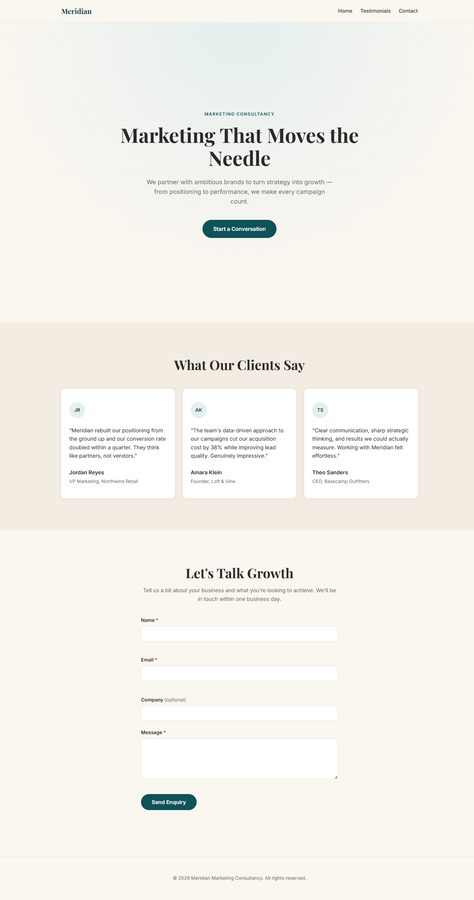

# Meridian Marketing Site

A static, single-page marketing site for Meridian, a marketing consultancy, in a Scandinavian-inspired design (paper-neutral palette, pine/clay accents, hairline dividers). Plain HTML/CSS/JS — no framework, no build step, no package manager.

**Live site:** https://terencesia.github.io/ClaudeProject/ (deployed automatically via GitHub Actions on every push to `main`)

## Structure

- `index.html` — page content: nav (with mobile hamburger menu), hero, services, free growth audit offer, testimonials, contact form, floating WhatsApp chat widget, footer. Includes SEO meta tags, Open Graph/Twitter tags, and JSON-LD structured data.
- `styles.css` — all styling, driven by CSS custom properties defined in `:root`
- `script.js` — mobile nav toggle, smooth-scroll for anchor links, WhatsApp widget toggle/quick-replies, and contact form handling (validation, submit state, FormSubmit submission)
- `robots.txt` / `sitemap.xml` — crawler directives pointing at the live Pages URL
- `assets/favicon.svg` — site favicon

## Lead generation

The site is built around a single conversion goal: get visitors to submit the enquiry form in exchange for a free 20-minute growth audit. The offer is introduced in the hero, expanded in a dedicated section, and echoed in the contact form's headline and button copy.

## Running locally

There's no build step — just open `index.html` directly in a browser.

## Contact form

The form posts to [FormSubmit](https://formsubmit.co) via `fetch()`, delivering enquiries to the address configured in `FORMSUBMIT_ENDPOINT` in `script.js`. FormSubmit requires a one-time confirmation: the first real submission to a given address triggers an activation email that must be clicked before further submissions are delivered.

## WhatsApp widget

A floating button in the bottom-right corner opens a small panel with a few suggested queries (free audit, general question, schedule a call, request a quote). Selecting one opens `https://wa.me/<number>?text=...` in a new tab with that message pre-filled. The number is set via `WHATSAPP_NUMBER` in `script.js`.

## Customizing

Colors, fonts, spacing, radius, and max-width are all centralized as CSS custom properties at the top of `styles.css` — edit those rather than hunting for hardcoded values throughout the file.
